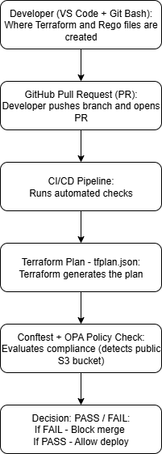

# Policy-as-Code Lab 01: Deny Public S3 Buckets (Terraform + OPA)

A hands-on Policy-as-Code lab demonstrating how to detect and block public S3 bucket access using Terraform plans, OPA, and Conftest before deployment.

---

## Objective 

Implement a pre-deployment compliance control that blocks any S3 bucket policy granting public access ("Principal": "*") before the resource reaches AWS.

This lab demonstrates shift-left compliance using:
- **Terraform** for Infrastructure-as-Code (IaC)  
- **Open Policy Agent (OPA)** + **Conftest** for Policy-as-Code  
- **Rego** language for declarative compliance rules  
- **VS Code + Git Bash** as the local DevSecOps environment

---

## Development Environment

All IaC and policy-as-code testing for this lab was performed locally using:

| Tool                                      | Purpose                                                            |
| ----------------------------------------  | ------------------------------------------------------------------ |
| **Visual Studio Code (VS Code)**          | Primary IDE for editing Terraform (`.tf`) and Rego (`.rego`) files |
| **Git Bash (in VS Code terminal)**        | Used to run AWS CLI, Terraform, and Conftest commands              |
| **Terraform v1.13+**                      | Infrastructure-as-Code engine for generating the plan JSON         |
| **Conftest + OPA (Open Policy Agent)**    | Policy-as-Code framework for compliance scanning                   |
| **AWS CLI v2 + SSO profile (`yourname`)** | Authenticated access to AWS account for plan generation            |

**Workflow Summary**

1. Open project in VS Code.
2. In Git Bash terminal:

```bash
aws sso login --profile yourname
export AWS_PROFILE=yourname
```
3. Run Terraform (`init`, `plan`, `show`) inside VS Code.
4. Test the resulting tfplan.json with Conftest + Rego.

---

## Architecture Flow



This diagram represents shift-left compliance - security and GRC checks are run during development, before infrastructure is deployed.

---

## Project Structure

```markdown
aws-grc-labs/
│
├── main.tf                 # Terraform config for test bucket + policy
├── tfplan.bin              # Terraform binary plan
├── tfplan.json             # Terraform plan in JSON
├── deny-public-s3.rego     # OPA policy
└── README.md               # This file
```
---

### 1️⃣ Terraform Configuration (main.tf)

```hcl
terraform {
  required_providers {
    aws = {
      source  = "hashicorp/aws"
      version = "~> 5.0"
    }
  }
}

provider "aws" {
  region  = "us-east-1"
  profile = "yourname"
}

resource "aws_s3_bucket" "demo" {
  bucket = "yourname-grc-lab-demo-12345"
}

resource "aws_s3_bucket_policy" "demo_policy" {
  bucket = aws_s3_bucket.demo.bucket

  policy = jsonencode({
    Version = "2012-10-17"
    Statement = [
      {
        Sid       = "PublicRead"
        Effect    = "Allow"
        Principal = "*"
        Action    = "s3:GetObject"
        Resource  = format("arn:aws:s3:::%s/*", aws_s3_bucket.demo.bucket)
      }
    ]
  })
}
```

### 2️⃣ Generate the Terraform Plan

```bash
export AWS_PROFILE=yourname
terraform init
terraform plan -out=tfplan.bin
terraform show -json tfplan.bin > tfplan.json
```
✅ tfplan.json is now your evidence file for compliance testing.

### 3️⃣ Rego Policy (deny-public-s3.rego)

```rego
package s3policy

deny contains msg if {
  res := input.planned_values.root_module.resources[_]
  res.type == "aws_s3_bucket_policy"

  policy_str := res.values.policy
  policy := json.unmarshal(policy_str)

  stmt := policy.Statement[_]
  stmt.Effect == "Allow"
  stmt.Principal == "*"

  msg := sprintf("Bucket policy allows public access: %v", [stmt.Resource])
}
```

### 4️⃣ Run the OPA Test

```bash
conftest test tfplan.json -p . --all-namespaces
```

✅ Expected output:

```ruby
FAIL - tfplan.json - s3policy - Bucket policy allows public access: arn:aws:s3:::yourname-grc-lab-demo-12345/*
1 test, 0 passed, 0 warnings, 1 failure, 0 exceptions
```

---

## Control Mapping

| Framework                                        | Control                                 | Description                                      |
| ------------------------------------------------ | --------------------------------------- | ------------------------------------------------ |
| **NIST 800-53 Rev 5**                            | **SC-7 / SC-15**                        | Boundary protection & public access restrictions |
| **ISO 27001 A.8.24**                             | Information security for cloud services |                                                  |
| **AWS Foundational Security Best Practice S3.1** | S3 buckets should block public access   |                                                  |

---

### Shift-Left Explanation

Traditional security tools (e.g., AWS Config) run after deployment.
In this lab, Conftest + OPA scan the Terraform plan itself, enabling shift-left compliance, where misconfigurations are detected before any resource is provisioned.
This approach demonstrates the Policy-as-Code model, where security and compliance rules are version-controlled and automatically tested just like application code.

<details> <summary> <strong>How Conftest, OPA, and Terraform Work Together</strong> (click to expand)</summary>

- Conftest is a CLI wrapper that uses the OPA engine under the hood.
- You give Conftest an input file (tfplan.json) and Rego policies.
- Conftest invokes OPA to evaluate those policies against the plan and reports PASS/FAIL.
- The Terraform plan JSON was tested with with:
```bash
conftest test tfplan.json -p . --all-namespaces
```
- By default, Conftest looks in a ./policy/ directory.
- Since this Rego is in the current folder, I explicitly pointed Conftest to “here” with -p ..
- Conftest runs rules in package main by default.
- Because the policy is in package s3policy, I added --all-namespaces so it gets evaluated.

| Tool          | Role                                          | Touches AWS?            |
| ------------- | --------------------------------------------- | ----------------------- |
| **Terraform** | Generates the plan of intended infrastructure | Queries AWS (read-only) |
| **Conftest**  | Runs tests using OPA policies                 | No                      |
| **OPA**       | Executes Rego logic inside Conftest           | No                      |

Together, Terraform + Conftest + OPA form a pre-deployment compliance pipeline, validating your IaC before it ever reaches AWS.

- OPA = policy engine.
- Conftest = friendly CLI that runs OPA on your files.
- Put policies in ./policy or use -p ..
- Use --all-namespaces if your package isn’t main.

</details>

---

## Skills Demonstrated

- Policy-as-Code enforcement with OPA/Rego  
- Infrastructure-as-Code security validation (Terraform)  
- Shift-Left compliance implementation  
- AWS S3 and IAM fundamentals  
- CI/CD readiness and DevSecOps tooling (VS Code + Git Bash workflow)

---

## Summary

This lab demonstrates Infrastructure-as-Code security using Terraform + OPA + Conftest.
By scanning the Terraform plan with Rego policies before deployment, you’ve implemented a practical shift-left GRC control that aligns with real-world DevSecOps pipelines.

---
